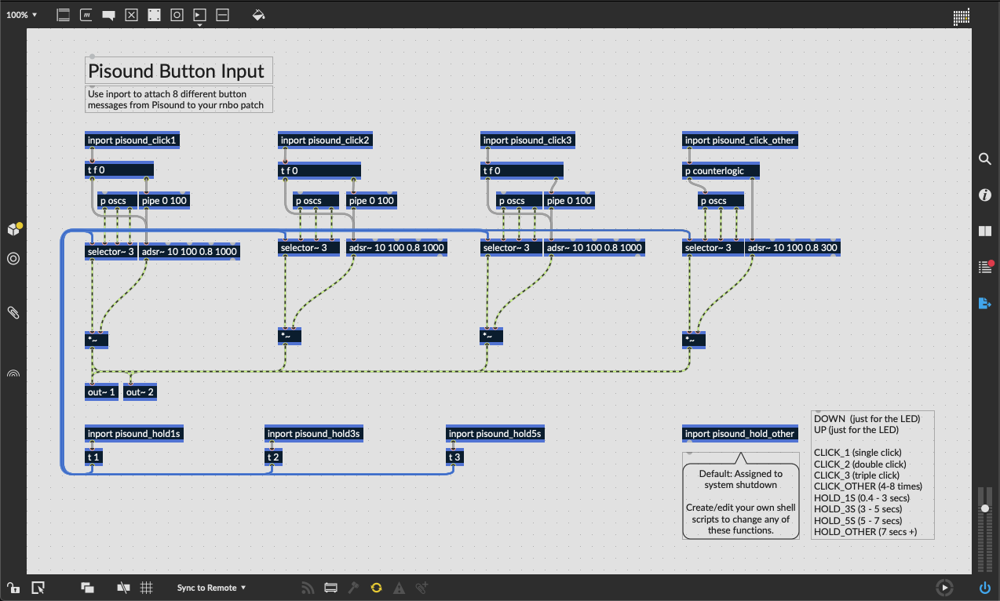

# RNBO-PiSound
Useful stuff for using PiSound with RNBO.

## Dependencies
These scripts depend on `liblo` to communicate with RNBO via OSC inside shell scripts

1. run `pisound_rnbo_install.sh` to install deps

## RNBO Button Remapper
Patcher examples and sripts to let you map the button to whatever you want in your RNBO patcher

 

## Default Button mappings:  

| Event      | Button Action                             | Default Pisound Script    |   Default RNBO Script      |
|------------|-------------------------------------------|---------------------------|---------------------------|
| DOWN	     | Button gets pushed down.	                 | down.sh                   | rnbo_down.sh               |
| UP	     | Button gets released up.	                 | up.sh                     | rnbo_up.sh                 |
| CLICK_1	 | Button was clicked once.	                 | start_puredata.sh         | rnbo_oneclick.sh           | 
| CLICK_2	 | Button was double-clicked.    	         | stop_puredata.sh          | rnbo_dblclick.sh           |
| CLICK_3	 | Button was triple-clicked.	             | toggle_wifi_hotspot.sh    | rnbo_trplclick.sh          |
| CLICK_OTHER| Button was clicked between 4 and 8 times. |	do_nothing.sh            | rnbo_clickother.sh         |
| HOLD_1S	 | Button was held down between 0.4s and 3s. |	do_nothing.sh            | rnbo_hold1.sh              |
| HOLD_3S	 | Button was held down between 3s and 5s.	 | toggle_bt_discoverable.sh | rnbo_hold3.sh              | 
| HOLD_5S	 | Button was held down between 5s and 7s.	 | shutdown.sh               | rnbo_hold5.sh              |
| HOLD_OTHER | Button was held down for more than 7s.    | do_nothing.sh             | rnbo_shutdown.sh           |
  
    
## Adding More Button Actions
[Shell scripts](https://www.raspberrypi.org/documentation/linux/usage/scripting.md) are really powerful for getting your Pi to undertake activitites like running other scripts etc.

You should try making your own scripts too using the above as inspiration.

For a new button action to appear in the pisound-config button action list
1. a new .sh script should be added to `/usr/local/pisound/scripts/pisound-btn/`
2. Make sure the 'execute' (`chmod +x yourcustomscript.sh`) permission is set for the new script. 
3. The file name will appear in `pisound-config`'s Pisound Button Settings which can be used for mapping as an action for The Button interaction.
